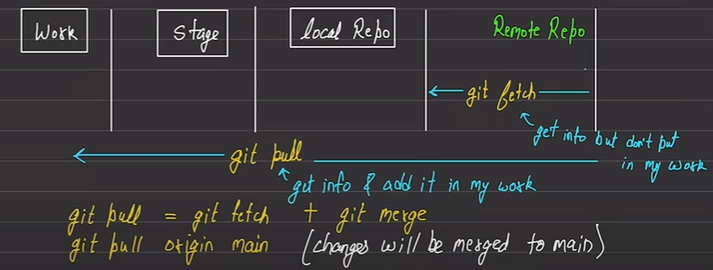

# Git: Let's Commit!

*Git is a version control system*

_Download_ -> git-scm.com
_Video I Watched_ -> https://www.youtube.com/watch?v=zTjRZNkhiEU&ab_channel=freeCodeCamp.org

## Lexis
- repo - directory / folder for git
- .git folder - history of files and folders and sub-folders
- .gitignore file - has all files ignored by git when git add all and commits, no quotes, you can use ![.gitignore generators]
- HEAD - points to latest of commits of a branch; you can change its pointer

## Commands
`git --version` - anything fine > 2.1.0

---

`git config --global user.name "Hardik J."`  
`git config --global user.email "hardik.j@gmail.com"`  
`git config --global core.editor "code --wait"` - set commit's message's input editor, default is VIM

---

`git init` - repo made

---

`git status` - to get status of repo

---

`git add` - stage files
- `git add .` - stage all files
- `git add <filename> <filename2>` - stage file filename  

---

`git rm --cached <filename>` - to unstage a file

---

`git restore <file>` - restores file from last comit of branch you are in  
`git restore --staged <file>` - to get it down from stage

---
NOTE: Git doesnt allows you to switch branches if you havent commited.  
`git commit` - "save checkpoint", always give -m
- `git commit -m "added file 1"` - with message
- if you are stuck in vim editor by not commiting with message, do hotkey (esc : q) or (q!)
- `git commit -am "message"` - adds and commits in one line

---

`git log` - log, top is latest
- `git log --oneline` - oneline

---

NOTE: Git doesnt allows you to switch branches if you havent commited.  
`git branch` - branchessssssss, gives all branches
- `git branch <branch-name>` - creates a new branch
- `git checkout <branch-name>` or `git switch <branch-name>` - moves to other branch's latest commit
- `git checkout -b <branch-name>` or `git switch -c <branch-name>` - create a branch and move to it
- `git branch -d <branch-name>` - delete a branch, not its history 
- `git branch -M main` - to rename branch you are in to main 
- .
- `git checkout <commit_id>` - to go back commits TO MOVE HEAD
- `git checkout master` - to go to top of master's latest commit
- `git reflog` - moves your head to back were you were
- `git checkout HEAD~<num>` - moves 'num+1' commits back

---

`git merge` - merging branches, merging is a type was commit
- be on the branch to keep and merge other branch onto yours
- `git merge <branch-name>` - <branch-name> comes into my branch

---

`git diff` - find difference between the same file between either diff commits, diff branches, before and after stage
- **How to read em**
    - a -> file 1 & b -> file 2
    - (- minus) represents file a & (+ plus) represents file b  
- `git diff --staged` - for all files, staged vs last commit
- `git diff <commit_id_1_first_six_char> <commit_id_2>` or `git diff <commit_id_1>..<commit_id_2>` - for all files, commits "in ring"
- `git diff <branch_1> <branch_2>` or `git diff <branch_1>..<branch_2>`

---

`git stash` - switch branches without commiting or staging, saves
- `git stash pop` - to bring them back when you come back to branch, AND TO OTHER BRANCHES
- `git stash list` - does any stash exists, it gives its list
- `git stash apply <stash@(num)>` - to apply changes into stash (not sure what he meant there :,))

---

☠️`git rebase` - CLEAN UP TOOL (Excited! Who doesn't like clean code.)
- NOTE: NEVER run this command whilst you are on the main/master branch!!  
        NEVER rebase if you have shared commits or are gonna push it on GitHub
- `git rebase master` - all commits from creating of branch you are on, till the latest one,  
        all of master's part in that duration is removed, and your branch comes on top
- IF found conflicts, read the terminal output and follow the instructions

[[I wasn't completely satisfied by the content given on git rebase compared to its introduction,  
so I did some more research and cleared it out]]  
-> git merge - use it when you want to keep feature branch's commit safe
-> git rebase - use it when you dont want feature branch's commit safe

## Miscellaneous
**Atomic Commits**  
* Keep commits centric to one feature, one component or one fix, __ONE THING__  
* Use present tense and imperitive sentences (give order to code base)

**Git Handling Merging Conflicts**  
* it adds this onto code of conflict  
>> '<<<<<<<<< HEAD  
> line 1  
> line 2  
> =============  
> line 3  
> '>>>>>>>>> branch2  
- and fix it manually

**Infos**  
* .gitconfig in users/youruser has your user.name and user.email etc stored
* Git works on kinda blockchain with a block having: hash, parent, info
* .git has hooks/ which contains files to run functions in pre-commit, post-commit, etc. events.
* some say rename branch master to main.
* NOTE: Git doesnt allows you to switch branches if you havent commited.

**GitHub**  
*Tips & Notes*
* You cant push password based code  
* remote is kinda... remote. You fetch and push it
* Generate SSH key!

*Commands*  
`git remote` - work with pushing and all
- `git remote -v` - to view if any connection to GH remote is made
- `git remote add <name> <url>` - connect to <url> and push your remote as the <name>
- `git remote rename <oldname> <newname>` - to change remote name
- `git remove remove <name>` - removes remote

`git push` - push remote to GH
- `git push <remote> <branch>` - push main to GH! &emsp;&emsp;&emsp; OR
- <3 `git push -u <remote> <branch>` - this sets an upstream so next time you just do git push "and all cool. DRY!"

`git clone` - when you clone a repo you only get main branch
- `git clone <url>` - get a repo's clone

